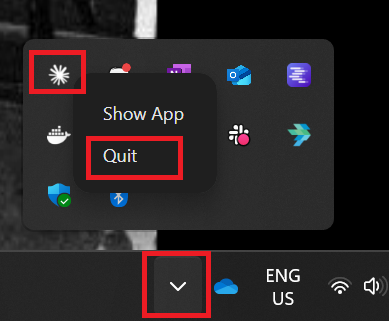
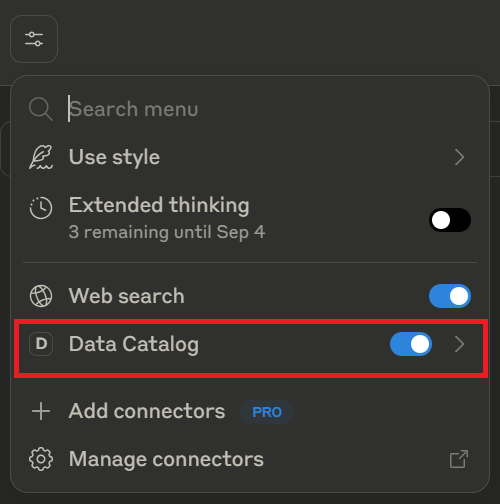
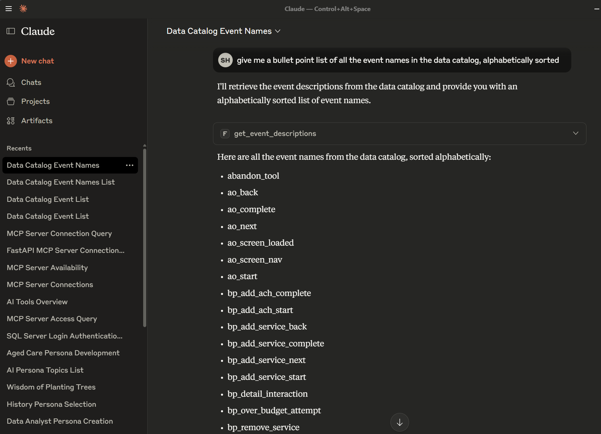
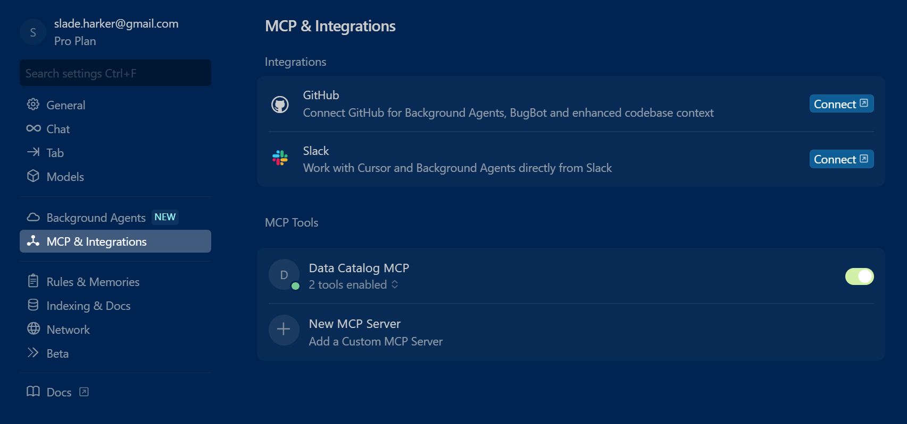

# DCMCP
Data catalog MCP server using FastMCP running on Docker.

## 1. Install linux, wsl2, and docker desktop

Follow these instructions up to installing Docker Desktop
https://liquid-interactive.atlassian.net/wiki/spaces/MAC/pages/4075618546/Local+environment+setup+guide

Also install Python 12 (12.0 or greater) if not already on your system
https://www.python.org/downloads/release/python-3120/

## 2. Build image and load into docker

In the directory of the solution on you machine run the following commands:
```
docker compose build --no-cache server 
docker compose up -d
```

## 3. Update Claude desktop
### 3.1 Setup MCP config
In Claude Desktop click File -> Settings, then select Developer
Click on Edit Config button
Put in the following config

```json
{
  "mcpServers": {
    "Data Catalog": {
      "command": "npx",
      "args": [
        "-y",
        "mcp-remote@latest",
        "http://localhost:8005/mcp",
        "--transport",
        "http",
        "--allow-http",
        "--request-timeout",
        "60000"
      ]
    }
  }
}
```

### 3.2 Close Claude and the background process.



### 3.3 Restart Claude, the MCP server should show in the list




The model should be able to call it to complete requests




## 4. In Cursor

Go to Cursor Settings -> MCP & Integrations, under MCP Tools add a new MCP Server.


```json
{
  "mcpServers": {
    "data-catalog": {
      "command": "npx",
      "args": [
        "-y",
        "mcp-remote",
        "http://localhost:8005/mcp",
        "--allow-http"
      ]
    }
  }
}
```



## Run locally

Install deps (recommended with `uv`):

```bash
uv pip install -r requirements.txt
```

Start the HTTP server:

```bash
uvicorn app:app --host 0.0.0.0 --port 8005 --log-level debug
```

The MCP HTTP endpoint will be served at `http://localhost:8005/`.

### Environment variables with .env

You can create a `.env` file by copying the example:

```bash
cp env.example .env
```

The app loads `.env` automatically at startup. Edit values like `AUTH_BEARER_TOKEN`, `BASIC_AUTH_USER`, etc.


## Authentication

Simple optional auth is provided via middleware. Configure using environment variables:

- `AUTH_BEARER_TOKEN` (or `AUTH_TOKEN`): shared bearer token value
- `BASIC_AUTH_USER` and `BASIC_AUTH_PASS`: enable HTTP Basic auth
- `AUTH_EXEMPT_PATHS`: comma-separated path prefixes to bypass auth (default: `/health,/metrics`)
- `AUTH_EXEMPT_TOOLS`: comma-separated MCP tool names that bypass auth when invoked via `/mcp` (e.g., `add,get_event_descriptions`)
- `AUTH_EXEMPT_METHODS`: comma-separated MCP JSON-RPC method names allowed without auth for handshake/bootstrap. Default: `initialize,tools/list,ping,resources/list,prompts/list`.
- `AUTH_PUBLIC_GET_MCP`: if `true`, allow unauthenticated `GET /mcp` (some clients open a stream). Default: `false`.

If no credentials are set, auth is disabled and all requests are allowed.

Examples:

```bash
# Run with bearer token
AUTH_BEARER_TOKEN=secret uvicorn app:app --host 0.0.0.0 --port 8005

# Call with bearer token
curl -i -H "Authorization: Bearer secret" http://localhost:8005/mcp

# Run with basic auth
BASIC_AUTH_USER=admin BASIC_AUTH_PASS=s3cr3t uvicorn app:app --host 0.0.0.0 --port 8005

# Call with basic auth
curl -i -u admin:s3cr3t http://localhost:8005/mcp

# Bypass auth for selected tools only (e.g., allow calling `add` without credentials)
AUTH_BEARER_TOKEN=secret AUTH_EXEMPT_TOOLS=add uvicorn app:app --host 0.0.0.0 --port 8005

# Allow unauthenticated handshake but require auth for tool calls
AUTH_BEARER_TOKEN=secret AUTH_EXEMPT_METHODS=initialize,tools/list,ping uvicorn app:app --host 0.0.0.0 --port 8005
```


## References

- Official Python SDK for MCP server: `https://github.com/modelcontextprotocol/python-sdk`
