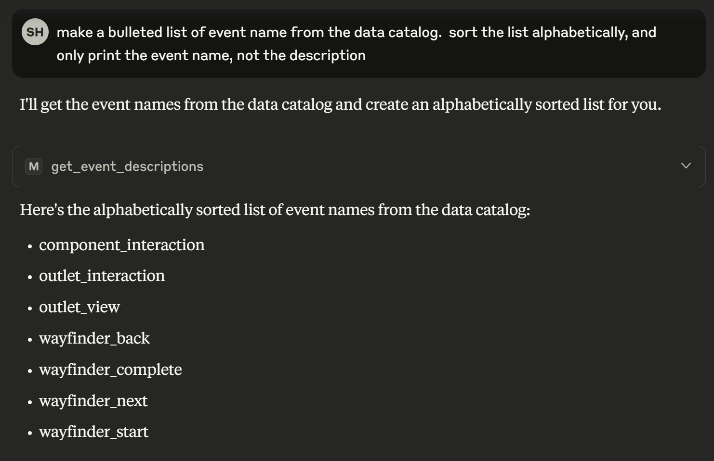

# DCMCP
Data catalog MCP server using FastMCP running on Docker.

## 1. Install linux, wsl2, and docker desktop

Follow these instructions up to installing Docker Desktop
https://liquid-interactive.atlassian.net/wiki/spaces/MAC/pages/4075618546/Local+environment+setup+guide

Also install Python 12 (12.0 or greater) if not already on your system
https://www.python.org/downloads/release/python-3120/

## 2. Build image and load into docker

In the directory of the solution on you machine run the following commands:
```
docker compose build --no-cache server 
docker compose up -d
```

## 3. Update Claude desktop
### 3.1 Setup MCP config
In Claude Desktop click File -> Settings, then select Developer
Click on Edit Config button
Put in the following config

```json
{
  "mcpServers": {
    "Data Catalog": {
      "command": "npx",
      "args": [
        "-y",
        "mcp-remote",
        "http://localhost:8005/",
        "--transport",
        "http-first",
        "--allow-http"
      ]
    }
  }
}
```

### 3.2 Close Claude and the background process.


### 3.3 Restart Claude, the MCP server should show in the list


The model should be able to call it to complete requests




## 4. In Cursor

Go to Cursor Settings -> MCP & Integrations, under MCP Tools add a new MCP Server.


```json
{
  "mcpServers": {
    "Data Catalog": {
      "command": "npx",
      "args": [
        "-y",
        "mcp-remote",
        "http://localhost:8005/mcp",
        "--transport",
        "http-first",
        "--allow-http"
      ]
    }
  }
}
```


## Run locally

Install deps (recommended with `uv`):

```bash
uv pip install -r requirements.txt
```

Start the HTTP server:

```bash
uvicorn app:app --host 0.0.0.0 --port 8005 --log-level debug
```

The MCP HTTP endpoint will be served at `http://localhost:8005/`.


## References

- Official Python SDK for MCP server: `https://github.com/modelcontextprotocol/python-sdk`
